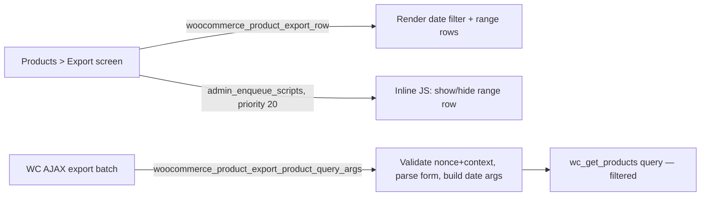

# Technical Plan — Export Filters for WooCommerce

## Stack (exact versions)
- PHP >= 7.4 (WordPress.org's own floor at time of writing; no PHP 8-only
  syntax needed for this scope).
- WordPress >= 6.4. WooCommerce >= 8.0 (hooks used are stable since WC 3.5.0;
  8.0 is chosen as the tested-baseline floor — recent enough to keep the test
  matrix small, old enough to cover the vast majority of active installs).
  Developed and verified against WooCommerce 11.0.0 source.
- No third-party PHP dependencies (no Composer packages beyond WordPress/
  WooCommerce themselves) — the whole plugin is one small class hooked into
  WooCommerce's own exporter.
- Why this stack: the project's entire value is "extend WooCommerce's native
  exporter via hooks, add nothing else" — pulling in a dependency or a build
  toolchain would contradict that positioning.

## Support matrix & budgets
- Minimum supported: PHP 7.4, WordPress 6.4, WooCommerce 8.0.
- Tested up to: PHP 8.3, WordPress current, WooCommerce 11.0.0 (Phase 7
  verifies the exact "Tested up to" values against what actually ran).
- Performance budget: the plugin's own query-args filter must add negligible
  overhead (string parsing + one `checkdate()` call) — not a bottleneck
  regardless of catalog size, since it changes the query's WHERE clause, not
  its execution model.

## Architecture
Single-responsibility hook class, no persistence, no external calls.

- **Components:** one PHP class (`EFWC_Date_Filter`), one small inline JS
  snippet (no separate `.js` file — see the front-end assets note below), no
  PHP classes beyond the one filter handler for v1.
- **Data flow:** WooCommerce owns the whole request/response cycle; the plugin
  only participates at three fixed points (render, enqueue, filter query args)
  and never intercepts batching, CSV writing, or the download step.
- **Persistence:** none. No schema, no migration, no `wp_options` row.

## Code map
| Path | State | Purpose |
|---|---|---|
| `export-filters-for-woocommerce.php` | [E] | Plugin bootstrap: header, WooCommerce-active guard, loads the includes, registers the `plugins_loaded` init hook |
| `includes/class-efwc-date-filter.php` | [E] | The `EFWC_Date_Filter` class: render, enqueue, query_args, clean_date (ported from `docs/filtros-exportador-woocommerce.md` §6, renamed to project conventions) |
| `languages/export-filters-for-woocommerce.pot` | [G] — generated by `wp i18n make-pot`, verified this session | Translation template, English source strings (11 msgids) |
| `languages/export-filters-for-woocommerce-es_ES.po` | [E] | Spanish translation (v1 ships es_ES per Phase 1 i18n decision) |
| `languages/export-filters-for-woocommerce-es_ES.mo` | [G] — compiled from the `.po` with `msgfmt` (verified this session); gitignored, regenerated at packaging time | Spanish translation, compiled |
| `readme.txt` | [E] | wordpress.org listing (description, changelog, "Tested up to", FAQ) |
| `uninstall.php` | [E] | No-op beyond WordPress's own plugin removal — no options/tables to clean, documented explicitly in a comment |
| `tests/bootstrap.php` | [E] | WP core PHPUnit test-suite bootstrap; locates WooCommerce by glob (L-001), defines `DOING_AJAX` for the suite |
| `tests/unit/test-clean-date.php` | [E] | Unit tests for `clean_date()` (AC-07) — 8 tests, all passing against the real WP core test suite |
| `tests/unit/test-query-args.php` | [E] | Unit tests for the args-building logic (AC-01, AC-03–07, AC-11) — 9 tests, all passing |
| `tests/e2e/export-date-filter.spec.js` | [E] | Playwright end-to-end test driving the real `Products > Export` screen against the wp-env playground (AC-01, AC-02, AC-03, AC-08, AC-09, AC-10, AC-12) — 5 tests, all passing headless |
| `.wp-env.json` | [E] | wp-env playground definition (WordPress + WooCommerce + this plugin), verified boots and both plugins report `active` |
| `tests/seed/seed-products.php` | [E] | WP-CLI-runnable script seeding 60 synthetic products across dates/statuses, large enough to force a multi-batch export (AC-08); simplified per L-002 |
| `.distignore` | [E] | Excludes `tests/`, `.wp-env.json`, dev tooling from the wordpress.org release ZIP |
| `phpcs.xml.dist` | [E] | WordPress coding-standard ruleset, verified clean (0 errors) |
| `composer.json` / `composer.lock` | [E] | Dev-only: phpcs + WooCommerce sniffs + PHPUnit Polyfills |
| `package.json` | [E] | Dev-only: wp-env + Playwright + axe-core, npm scripts for env/test |
| `playwright.config.js` | [E] | Headless Chromium, trace+video always on |
| `docs/api/hooks-and-filters.md` | [A] — the moment a Later-roadmap filter exposes a hook of its own | Documents the plugin's own extension points (none in v1 — it only consumes WooCommerce's) |

## Change map
| Change type | Touch always |
|---|---|
| New user-facing string | wrap in `esc_html__()`/`esc_html_e()` with text domain `export-filters-for-woocommerce`, regenerate `languages/export-filters-for-woocommerce.pot`, update `es_ES` `.po`/`.mo` |
| New filter row on the export screen (Later roadmap item) | render in `render_rows()` (or a new class per the Later-roadmap split), enqueue/JS toggle if it needs show/hide, query_args handling, migrate to manual `date_query` the moment a second date-adjacent filter lands (per `docs/02-functional-spec.md` Feature 2), a Playwright e2e case, an `AC-nn` in `docs/02-functional-spec.md`, `docs/api/hooks-and-filters.md` if it exposes a new hook of its own |
| New hook or filter exposed BY this plugin (none in v1) | fire site + docblock, `docs/api/hooks-and-filters.md` entry + `docs/api/INDEX.md` row, a test asserting it fires with its documented args |
| Version bump | plugin header `Version:`, `readme.txt` `Stable tag:`, changelog, `languages/*.pot` regenerated |
| New WooCommerce/WordPress minimum | plugin header `Requires at least:` / `Requires PHP:` / `WC requires at least:`, `readme.txt` matching fields, `docs/03-technical-plan.md` Support matrix |
| New dependency (any) | `docs/decisions.md` entry with alternatives considered, license compatibility verified against GPL-3.0-or-later, Support matrix updated if it moves a floor |

## Conventions
- Prefix/namespace: `EFWC_` for every class; `efwc_` for any procedural
  function or option key (none planned for v1); `export-filters-for-woocommerce`
  as the text domain and plugin slug.
- Naming: classes `EFWC_Snake_Case_Words`; methods `snake_case()`; the single
  v1 class is `EFWC_Date_Filter`, mirroring `docs/filtros-exportador-woocommerce.md`
  §6's `JC_Product_Export_Date_Filter` renamed to convention.
- Error handling: no exceptions — every failure path (invalid nonce, invalid
  date, WooCommerce inactive) fails safe and silent to native behavior, per
  `docs/02-functional-spec.md`. No `WP_Error` needed since nothing here returns
  a value the caller inspects for error state; user-facing errors do not exist
  in this feature's scope (invalid dates are dropped, never surfaced as
  rejection messages, to avoid interrupting the native export flow).
- Logging: none by default (no product operation here writes data or calls an
  external service, so there is nothing worth logging under normal operation).
  If a debug log is added later for the Later-roadmap filters, it follows the
  standard `WC_Logger` pattern with a settings checkbox, per Keel's default —
  reserved, not built for v1.

## Testing
- **Unit tests:** WordPress's own PHPUnit test suite (`WP_UnitTestCase`,
  via `wp-env` or a local `wordpress-develop` checkout). Run command:
  `wp-env run tests-cli --env-cwd=wp-content/plugins/export-filters-for-woocommerce phpunit`
  (verified end-to-end at the Phase 5 scaffold; exact command confirmed there).
- **Integration and end-to-end tests:** Playwright, run command
  `npx playwright test` from the plugin root, against the wp-env playground
  started at `http://localhost:8888/wp-admin/`. E2E is required here because
  the feature is entirely a UI flow inside an existing multi-step AJAX form —
  unit tests alone cannot prove the date-range row shows/hides correctly or
  that a real multi-batch AJAX export honors the filter (AC-08).
  - Unit coverage: `clean_date()` validation logic, the args-building branches
    (single day / open left / open right / swap-on-inversion) — pure functions
    of their inputs, no WordPress runtime state needed beyond what the WP test
    suite stubs.
  - E2E coverage: the full admin flow (select field → range appears → fill
    dates → Generate CSV → download → verify CSV content) against seeded data,
    including the multi-batch case (AC-08) and the keyboard-only interaction
    case (AC-02, AC-12).
- **Verification playground:** `wp-env` (per `references/playground-recipes.md`
  — the standard WordPress-plugin recipe), with WooCommerce installed as a
  dependency plugin. `.wp-env.json` mounts this plugin plus WooCommerce.
  Start: `wp-env start`. Stop: `wp-env stop`. Seed:
  `wp-env run cli wp eval-file wp-content/plugins/export-filters-for-woocommerce/tests/seed/seed-products.php`
  — creates ~30 synthetic products spread across dates/statuses, large enough
  to force a multi-batch export at the native batch size. Reset:
  `wp-env clean all` (or `wp-env destroy` + `wp-env start` for a full reset).
  Access details and try-it steps for the user land in `docs/playground.md` at
  the Phase 5 scaffold.
- **Driver per surface:**
  | Surface | Driver | Headless? | Evidence it produces |
  |---|---|---|---|
  | `Products > Export` admin screen (WP admin, browser) | Playwright | Yes | Trace + video + assertions on rendered DOM and downloaded CSV content |
  | `woocommerce_product_export_product_query_args` filter (server-side logic) | PHPUnit / `WP_UnitTestCase` | Yes (CLI) | Assertion output, exit code |
  No surface here takes over the user's screen — everything runs headless in
  CI-style automation; no mitigation needed.
- **Run mode and recording (browser surfaces):** headless is the default
  (`npx playwright test`); a headed/slowed debug run is available via
  `npx playwright test --headed --debug`. Video and trace are always ON for
  the headless run (`trace: 'on'`, `video: 'on'` in `playwright.config.js`),
  artifacts written to `test-results/`, retained until the next run overwrites
  them (no long-term retention needed for a project this size).
- **Element addressability:** every interactive element the plugin adds carries
  a stable `id` already required for its `<label for>` binding
  (`jc-export-date-field` → renamed `efwc-export-date-field`,
  `efwc-export-date-from`, `efwc-export-date-to`); Playwright selectors bind to
  those IDs, never to the translated visible label text.
- **Division of labour:** the assistant drives every leg of this flow end to
  end (Playwright + PHPUnit, both headless). No leg needs `CREDENTIAL`,
  `HARDWARE`, `ASSISTIVE-TECH`, `JUDGMENT`, `EXTERNAL-APPROVAL`,
  `PLATFORM-IMPOSSIBLE`, `PRODUCTION-RISK`, or `NO-EXECUTION` — this project
  has no real assistive-technology pass requirement beyond the automated axe
  check (native WP admin controls are already screen-reader-tested by
  WordPress core itself; a manual screen-reader spot-check is offered to the
  user as an optional extra, not a gating requirement, given the surface is
  two native form rows).
- **Static analysis and sniffers:** `phpcs --standard=WordPress` (WordPress
  Coding Standards) and `phpcs --standard=WooCommerce` if the WC sniffs are
  available; `php -l` syntax check on every PHP file. Run at every Phase 5 test
  point, not once before release.
- **Accessibility automation:** `@axe-core/playwright` run against the
  `Products > Export` screen in both its states (range row hidden / shown)
  inside the e2e suite; plus a driven keyboard/focus-order pass (Tab through
  the new controls, confirm visible focus and correct tab order) as part of
  the same Playwright spec.
- **Read-back duty:** the Playwright spec asserts on `page.on('console')` for
  JS errors, `page.on('response')` for any non-2xx from the WooCommerce AJAX
  endpoint, and reads the downloaded CSV's actual content (not just "a file
  downloaded") to verify the filtered row set.
- **Performance budget measurement:** not separately measured — the change is
  a WHERE-clause addition to an existing native query; no new budget beyond
  "does not visibly slow the export batch loop," verified qualitatively during
  the multi-batch e2e run (AC-08).
- **Regression rule:** every bug fixed gets a test pinning the fix, written and
  seen failing before the fix, linked from `docs/lessons-learned.md` — holds
  regardless of the test-first policy below.
- **Test-first policy: `pure-logic`.** Recorded on the project card. `clean_date()`
  and the args-building branch logic are pure functions of their inputs and get
  their unit test written and seen failing before the implementation exists;
  the Playwright e2e suite (framework glue, DOM interaction) is written
  alongside the implementation as usual, not before it. See D-009.

## Environment requirements
| Requirement | Required version/state | Severity | Install (macOS / Windows / Linux) |
|---|---|---|---|
| Node.js | >= 18 (for `wp-env` and Playwright) | Blocking | macOS: `brew install node`; Windows: `winget install OpenJS.NodeJS.LTS`; Linux: distro package or `nvm` |
| `@wordpress/env` (`wp-env`) | latest, via `npx` (no global install required) | Blocking | `npx @wordpress/env start` — requires a running container runtime |
| Container runtime for `wp-env` | Docker Engine or Docker Desktop running | Blocking | macOS: Docker Desktop (flag: licensing depends on company size/revenue — Colima is the lighter free alternative) or Colima (`brew install colima docker && colima start`); Windows: Docker Desktop + WSL2; Linux: Docker Engine (no Desktop needed) |
| Playwright + browsers | latest, `npx playwright install` | Blocking (e2e only) | Same command all platforms; downloads browser binaries (~300MB) |
| PHP CLI | >= 7.4, matching the support matrix | Blocking (for `phpcs`/`php -l` outside the container) | macOS: `brew install php`; Windows: not required locally if all PHP execution happens inside `wp-env`'s containers; Linux: distro package |
| Composer | latest (only if `phpcs` is installed via Composer rather than globally) | Optional | Standard Composer install per OS |
| `phpcs` + WordPress Coding Standards ruleset | latest | Optional (static analysis) | `composer require --dev wp-coding-standards/wpcs` |
| `gh` CLI, authenticated | already present on this machine | Blocking (forge operations) | Already installed/authenticated |

No platform is impossible on this machine — everything above is standard
cross-platform WordPress-plugin tooling, verifiable at the Phase 5 scaffold's
`keel-doctor` run.

## Tooling commands
- lint: `phpcs --standard=WordPress export-filters-for-woocommerce.php includes/`
- test (unit): `wp-env run tests-cli --env-cwd=wp-content/plugins/export-filters-for-woocommerce phpunit`
- test (e2e): `npx playwright test`
- build: none — no compiled/bundled front-end asset for v1 (the one JS snippet
  is a small string passed to `wp_add_inline_script()`, not a separate file;
  no build/minify pipeline applies — see D-010).
- package: `wp dist-archive .` or a manual ZIP excluding `.distignore` entries,
  at Phase 7.

## Front-end asset build
Not applicable for v1: the only client-side code is a short inline script
registered via `wp_add_inline_script()` (mirrors
`docs/filtros-exportador-woocommerce.md` §6's `enqueue()` method) — there is no
standalone `.js`/`.css` file to pair with a minified sibling. If a Later-roadmap
filter needs real client-side logic large enough to warrant its own file, the
source-first/minified-pair contract applies from that point forward (D-010).

## Version touchpoints
- Plugin header `Version:` in `export-filters-for-woocommerce.php`
- `readme.txt` `Stable tag:`
- `languages/export-filters-for-woocommerce.pot` header (regenerated, not
  hand-edited)

## License & dependency compatibility
- Project license: GPL-3.0-or-later (Phase 1, D-004).
- No third-party dependencies in v1 — nothing to verify. Any dependency added
  later gets its license checked against GPL-3.0-or-later compatibility before
  adoption, per the change map row above.
