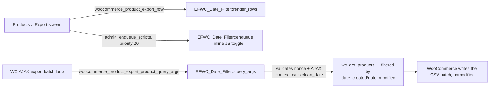

# Architecture — Export Filters for WooCommerce

## System overview
A single-responsibility WordPress plugin that extends WooCommerce's native
product CSV exporter (`Products > Export`) via three of WooCommerce's own
public hooks. It ships no separate export screen, no database schema, and no
external integration — it participates in an existing request/response cycle
at three fixed points and never touches WooCommerce's batching, column
selection, or download logic.

## Components
| Component | Responsibility |
|---|---|
| `export-filters-for-woocommerce.php` | Plugin bootstrap: header metadata, a WooCommerce-active guard (fails safe to an admin notice, never fatal), loads `includes/`, registers `EFWC_Date_Filter::init()` on `plugins_loaded` |
| `EFWC_Date_Filter` (`includes/class-efwc-date-filter.php`) | The entire feature: renders the two admin-screen rows, toggles the range row's visibility client-side, and translates the submitted filter into a WooCommerce-native query argument |

## Data flow

## Data model
None. The plugin is stateless: it reads two values that are already part of
WooCommerce's own export form submission (`$_POST['form']`, itself carrying
the plugin's own `efwc_date_field`/`efwc_date_from`/`efwc_date_to` fields
because WooCommerce serializes the whole form on submit) and writes one query
argument WooCommerce's own `wc_get_products()` already understands. No
database table, no `wp_options` row, nothing to migrate.

## External integrations
None. Every call in this plugin is a WordPress/WooCommerce core function call
within the same PHP process and the same HTTP request — no outbound network
call, no third-party service, no API key.

## Key decisions and why
Consolidated from `docs/decisions.md` — see that file for the full reasoning
of each:

- **D-001** — extend the native exporter via hooks; never replace it,
  never touch the importer. This is the entire competitive positioning
  (`docs/00-competitive-landscape.md`: no competitor does this).
- **D-004** — GPL-3.0-or-later, name "Export Filters for WooCommerce" (the
  native exporter is the only native WooCommerce exporter that exists today,
  verified against the WC 11.0.0 source — confirmed room to grow if that ever
  changes).
- **D-005** — v1 ships exactly the date filter; every other filter idea from
  the competitive confrontation is explicitly "Later," not silently dropped.
- **D-008** — the date-filter class is a direct port of an already
  WC-11.0.0-verified reference implementation, renamed to the `EFWC_`
  convention (D-012 makes `clean_date()` public for direct unit testing).
- **D-010** — no front-end build/minify pipeline: the only client-side code
  is a short string passed to `wp_add_inline_script()`.

## Extensibility (current state)
v1 exposes no hooks or public functions of its own — `docs/api/INDEX.md` is
intentionally empty. The moment a Later-roadmap filter adds one, this file
and `docs/reference/hooks-and-extension-points.md` are updated in the same
slice that adds it, per the change map in `docs/03-technical-plan.md`.
