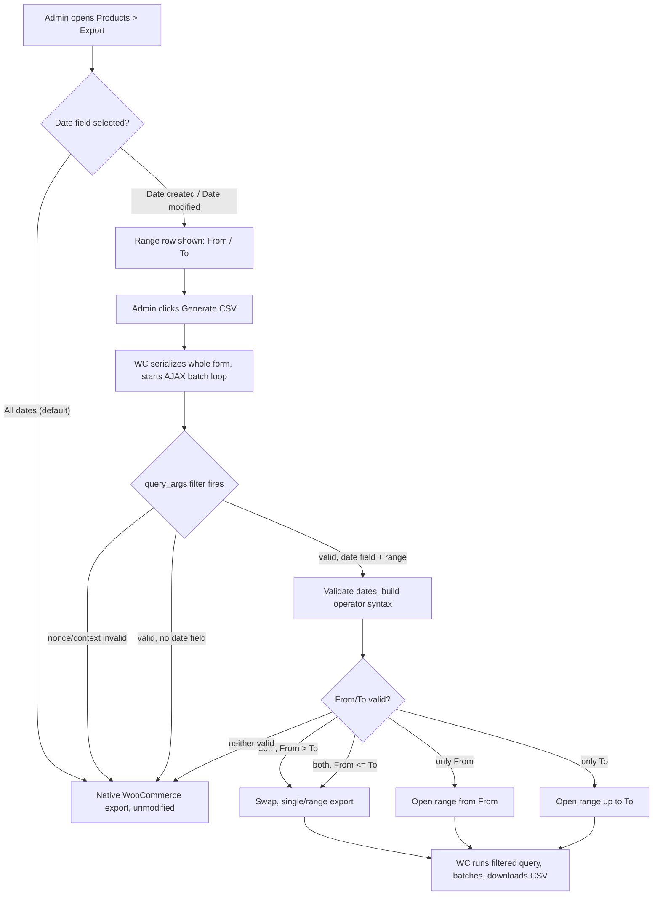

# Flow — Filter product export by date

## Trigger / entry point
Store admin (capability `edit_products` + `export`) navigates to
`Products > Export` (`edit.php?post_type=product&page=product_exporter`).

## Numbered steps

1. Admin opens `Products > Export`. The plugin's `woocommerce_product_export_row`
   handler has added two `<tr>` rows to the native form, inside `<tbody>`, before
   the native "Generate CSV" submit row: a "Filter by date" `<select>` (All dates /
   Date created / Date last modified) and a hidden date-range row (From / To).
2. Admin leaves the selector on "All dates" (default) → the range row stays
   hidden; behavior is byte-identical to stock WooCommerce.
   **Branch A — no date filter.**
3. Admin picks "Date created" or "Date last modified" → the plugin's inline JS
   (enqueued at priority 20, after WooCommerce's own handler at priority 10)
   shows the range row. Admin fills From, To, or both.
   **Branch B — date filter active.**
4. Admin clicks the native "Generate CSV" button. WooCommerce's own JS
   (`wc-product-export.js`) serializes the *entire* form into `data`, including
   the plugin's fields (they carry `name` attributes), and starts the AJAX batch
   loop (`processStep()` → `woocommerce_do_ajax_product_export`), resending the
   same `data` on every batch.
5. On the server, WooCommerce's exporter builds its query args and fires
   `apply_filters( 'woocommerce_product_export_product_query_args', $args )`.
   The plugin's handler:
   a. Verifies it is inside a real AJAX request, `$_POST['form']` is present, and
      the WooCommerce export nonce (`$_POST['security']`, action
      `wc-product-export`) is valid — else returns `$args` untouched (fail-open
      to native behavior, never fatal).
   b. Parses `$_POST['form']`, reads the date-field selector.
      **Branch A (All dates)** → returns `$args` untouched.
      **Branch B (a date field selected)** → reads From/To, validates each as a
      real `YYYY-MM-DD` calendar date (`checkdate()`), silently drops an invalid
      one instead of erroring the whole export, swaps From/To if inverted, and
      sets `$args['date_created']` or `$args['date_modified']` to the
      WooCommerce-native operator syntax (`from...to`, `>=from`, `<=to`).
6. WooCommerce runs the query with the filtered args, writes the batch to the
   CSV file, and responds with the percentage complete. The JS loop repeats step
   4–6 until 100%, then redirects to the download URL — unmodified WooCommerce
   behavior throughout; the plugin never touches batching, columns, or the
   download step.

## Branches and conditions
- **Branch A — "All dates" (default):** no query args changed; every downstream
  step is stock WooCommerce.
- **Branch B — a date field is selected:**
  - **B1 — both From and To filled, same date:** single-day export (`from...to`
    with equal bounds, inclusive both ends).
  - **B2 — both filled, From > To:** silently swapped, never returns zero rows.
  - **B3 — only From filled:** open-ended range from that date onward (`>=from`).
  - **B4 — only To filled:** open-ended range up to that date (`<=to`).
  - **B5 — neither filled despite a field being selected:** treated as
    equivalent to "All dates" (no query args changed) — no error shown.
  - **B6 — an invalid date is entered** (e.g. 30 February, or malformed input
    that bypasses the `<input type="date">` picker via a crafted request):
    silently dropped as if empty, never fatals the export.

## Failure paths and recovery
- **Missing/invalid nonce, or the filter fires outside a real AJAX export
  request** (e.g. another plugin/context triggers the same filter): the plugin
  returns `$args` unmodified — fails safe to native, unfiltered behavior. Never
  a fatal error.
- **WooCommerce inactive or too old to expose the hook:** the plugin's `init()`
  is gated behind a WooCommerce-active check; if absent, it does nothing and
  shows an admin notice (never fatals the site).
- **Large catalog, multi-batch export:** because the WooCommerce JS resends the
  entire serialized form on every batch call (see
  `docs/spec-references/filtros-exportador-woocommerce.md` §2 "El detalle clave"), the date
  filter persists automatically across all batches with no transient/session
  needed. Verified in Phase 5 test point with a catalog large enough to force
  more than one batch.

## Diagram

